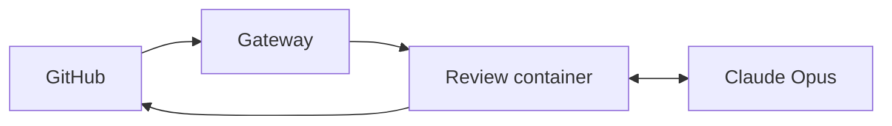

*How I built an agent to automate the grunt work of code review so that reviewers can focus more on intent and design.*

---

## 1. The problem: thorough code review is necessary but expensive

It's 2pm. My review queue has about a dozen pull requests in it. My team just finished their day and submitted them before signing
off. A few PRs run to several hundred lines. By the time I work through the queue, the authors are offline. Whatever feedback I
leave won't be read until they log on tomorrow.

I'm not the only reviewer on the team, but as tech lead I own what ships. If a PR doesn't fully address the problem, slips through with a subtle bug, or doesn't meet the quality bar, that's on me.

A good review asks multiple questions at once:

- **Is it correct?** Does the code do what the PR says it does?
- **Does it solve the problem?** Does the diff actually address the ticket that spawned it, not just look coherent in isolation?
- **Is the quality up to par?** Readability, naming, idiomatic usage of the language and frameworks.
- **What got missed?** Edge cases, security holes, performance cliffs, concurrency bugs.
- **Is it tested?** Evidence of automated tests, or at minimum a credible smoke test when end-to-end automation isn't practical.
- **What's next?** Follow-up work the PR surfaces but shouldn't absorb: tech debt, adjacent issues, design questions.

Before AI assistants, I used to do all of this manually: reading the diff, checking out the branch locally, sometimes running code to confirm what it does, walking up the call tree of affected code, cross-referencing library behavior, and writing comments by hand. That kind of thorough review is slow.

A reviewer needs to operate simultaneously at different levels of abstraction: assessing the big picture (intent, design, scope) while catching low-level implementation gotchas like a background task that reads from a request context after the context was reset, silently falling back to a default value. On a large diff, focus slips — and that's exactly when issues like that get through.

### A workaround: running the review on my laptop

I started by building a Claude Code slash command, `/review-pr`, that runs Opus at a high level of effort with full repo context and tool access. The prompt instructed the model to do a deep analysis, inspecting callers, surrounding code, and library sources, instead of basing its analysis on assumptions. Its most important instruction: before writing anything up, double-check Critical or Major findings. That single step meaningfully cut false positives.

I used it as a pre-filter on my own reviews. I would run the command, triage its notes and paste the useful ones into the PR as comments. Over time I developed confidence that the model was catching most coding issues, and I could focus on design and on whether the PR addressed all requirements.

It worked well — for me. But I couldn't reasonably expect the rest of the team to adopt the same workflow. Anything that adds friction to the development process — a specific prompt to run, a specific terminal-based tool to install, a specific flow to remember — tends to get skipped when people are busy shipping. Expecting every author to run this on their own PR before requesting review wasn't realistic.

And the hosted review bots we already use aren't enough either. They catch obvious issues and common code-quality problems — once we filter out their false positives — but Claude Code with Opus consistently finds issues those bots miss.

---

## 2. The solution: Astra

**Astra is a GitHub bot that runs a review workflow on demand in a sandboxed container.**

The goal was to **shift left**: let PR authors get the same deep review I'd been running from my terminal, before a human reviewer ever looks. Drop a `/astra review` comment on a PR and the bot does the rest.

### What makes Astra different

Astra is built to reason about a PR, not pattern-match one — what a careful reviewer does, given time and tools:

**1. Deep context.** Astra clones the repo at the PR's head, installs all dependencies, and points the agent at where those dependencies live on disk. When the PR calls a library, the agent doesn't have to guess what the library does — it can read the library code. That alone eliminates a huge category of false positives.

For example: a hosted bot once flagged a `posthog.capture` call inside an async handler as a blocking I/O hazard and told the author to move it to a thread. Astra read the PostHog SDK source and confirmed the opposite — `capture` just enqueues the event in memory; a background thread handles the flush. No fix needed. That's the difference between pattern-matching the shape of a call and verifying what it actually does.

**2. It runs code, not just reads it.** Astra installs the project's dev tools in the container. For dynamic languages like Python and TypeScript, where static reasoning only gets you so far, the agent can write and run small scripts to validate assumptions about behavior, like inspecting what a function returns for representative inputs, or whether a Python module imports without errors. That allows the model to review based on what the code *does*, not what it *looks like it should do*.

**3. Workflow awareness.** Astra plugs into the review process, not just the diff:

- **Reads the originating ticket.** It fetches the ticket linked in the PR description and uses the problem statement and acceptance criteria as context — so it can judge whether the PR actually solves the thing it was supposed to solve, not just whether the diff is internally coherent.
- **Reads prior review feedback.** Human comments, bot comments, resolved and unresolved threads. The agent is instructed to respond to each open thread — accepting, proposing alternatives, or pushing back with justification when a prior comment is invalid or already resolved.
- **Flags follow-up work.** It identifies improvements that are out of scope for this PR and suggests them as follow-ups rather than review blockers.

**4. Opinionated defaults.** The prompt encodes principles I want every review to apply:

- **Trust nothing at face value** — verify claims by reading the actual code.
- **Think adversarially** — nil/null/empty, concurrency, malformed data, retries, partial failure.
- **Demand correctness, not perfection** — strict on logic and security, not pedantic about style.
- **Suggest alternatives** — don't just flag, propose a fix.
- **Push back** — on scope, design, and ambiguous intent.
- **Check idioms** — flag reinvented wheels and misused APIs.

### Astra's architecture

Here's how a review flows:

**1. GitHub receives the command.** A PR author posts `/astra review` on a pull request. GitHub fires an `issue_comment` webhook at the gateway.

**2. The gateway hands the work off.** It validates the signature, drops a task on Cloud Tasks, and returns. The queue handles retries and rate-limiting.

**3. A fresh container spins up per review.** Every review runs in its own Cloud Run job — an ephemeral environment that sees only the secrets it needs: a short-lived GitHub installation token minted just for this run, plus the Anthropic API key and the Shortcut (tickets) API token pulled from Secret Manager. Least privilege, scoped to a single review, with nothing persisting between runs. The container then clones the repo at the PR's head, fetches the diff, PR metadata, existing review threads, and the linked ticket, then installs dependencies and dev tools.

**4. The agent loops with Claude.** Inside the container, the Claude Agent SDK runs the review skill. The agent reads the diff, walks into dependency source to verify library behavior, runs small scripts to observe actual behavior, and responds to each open thread. The edge between the container and Claude is a loop, not a single call — the model drives many tool invocations per review before emitting a structured JSON review at the PR, file and line levels. The loop has two hard stops: a maximum turn count so it can't spin forever, and a maximum cost per review so a misbehaving run can't generate a surprise bill.

**5. A Python harness posts back to GitHub.** The harness turns the JSON into a GitHub review via the GraphQL API, attaching each comment to the right file and line. Astra only posts comments — it never approves or rejects a PR. Approval is a human decision; Astra is there to inform it, not make it.

The split between steps 4 and 5 is the most important design choice in the whole system:

> **Use the agent's emergent reasoning for the review itself. Use deterministic Python for the algorithmic steps.**

I could have asked the agent to post the comments itself, but I've watched how that goes. When I tell Claude Code to post review comments on file lines, the agent routinely burns several failed requests before landing a valid one — GitHub's GraphQL mutation schema for anchored comments is finicky. That's tolerable when a human is watching; it's wasteful and fragile when the bot runs unattended. Judgment is what the model is good at, API calls and formatting are what code is good at.

---

## 3. The outcome

When I start reviewing a PR, the first thing I do is check whether Astra has run. If not — or if the author pushed changes after the last Astra run — I trigger it. Then I read its comments, assess them, and add my own observations on top. The bot catches the low-level stuff; I focus on intent, scope, and architectural direction.

**The same workflow is available to PR authors, which is the whole point.** They can get a deep, useful review and clean up issues that were found before proceeding to human review.

A handful of folks on the team have reached out unprompted — both as authors and as reviewers — to say they're finding Astra useful.

### What I'm seeing

- **Review cycles are faster.** Authors get feedback in 2–5 minutes instead of waiting overnight. Low-level issues get fixed before a human reviewer opens the PR.
- **Subtle issues get caught.** On one PR, Astra flagged that a user-supplied filter expression was evaluated as a regex in one code path and as a SQL `LIKE` substring match in another, across separate modules — so the same query returned different results depending on whether it hit the cache. That's the kind of cross-path inconsistency a careful human reviewer would likely miss on first pass, and a shallower review bot could miss entirely if the diff only touched one of the paths.
- **Follow-up work is captured.** "Out-of-scope but worth doing" observations become tickets instead of getting dropped on the floor or blocking merges.
- **Cost-effective for internal use.** Each review runs $0.50–$2.00 in API spend. Too expensive for a review bot that needs to turn a profit on its own, but cheap compared to the engineering time it saves.

### What I'd emphasize if you're building something similar

- **Give the agent a real workspace, not a diff in a vacuum.** Cloned repo, installed dependencies, readable library source, linked tickets, prior review threads. Every piece of context you add removes a class of false positives.
- **Let the ticket define scope.** The linked ticket and the PR description give the agent enough signal to judge what's a blocker versus what should be a follow-up — you don't need to hand-code scope rules. Skip that context and everything starts looking like a must-fix, and the signal drowns.
- **Let the agent reason, let the code execute.** Use the model for judgment and prose. Use Python for API calls, formatting, and anything you want to be deterministic. This split is what lets the bot run unattended without burning tokens on GraphQL retries.
- **The biggest win is for the author, not the reviewer.** A deep review before the human one shows up changes what the author ships, not just what the reviewer sees. Designing for the author-first flow changed which features mattered (e.g. responding to prior review threads) and which didn't.

Astra is changing what humans spend their review time on, not replacing human review. And that, for me, is the point.